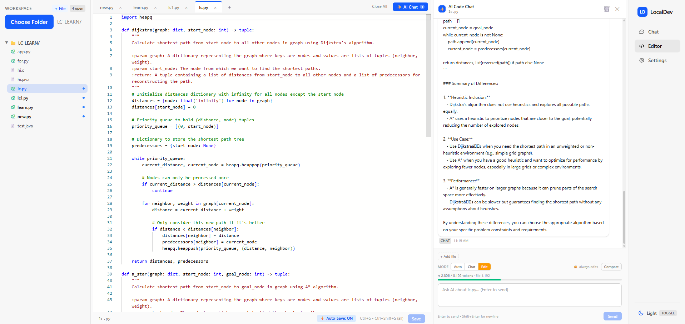
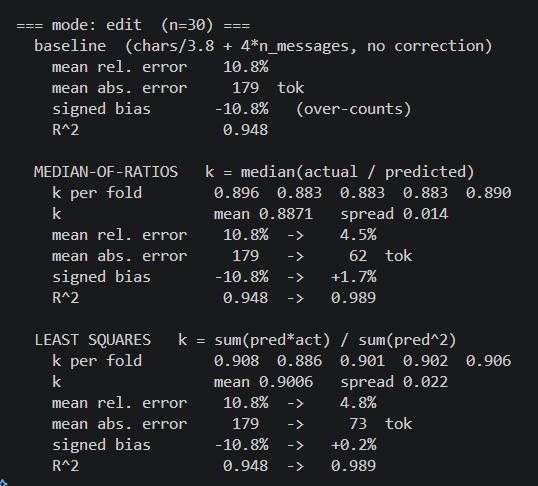
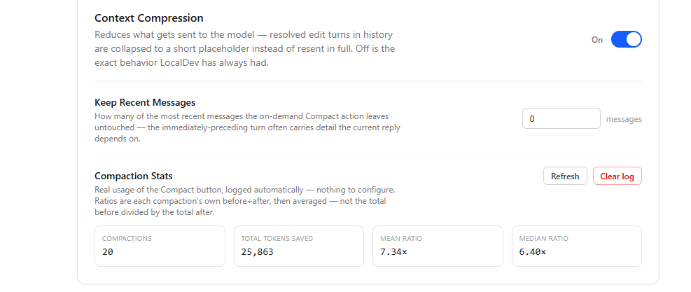

# LocalDev

A local-first AI coding assistant — a React code editor and chat UI backed by a
FastAPI server, talking entirely to a **local** LLM through
[LM Studio](https://lmstudio.ai/) (tested with `qwen2.5-7b-instruct-1m`). No
cloud API calls, no API keys, no telemetry — your code and conversations never
leave your machine.

The workspace folder is opened and read **in the browser** via the File System
Access API. The backend is a thin, stateless wrapper around the local model; it
never sees your files or paths — the frontend assembles everything it needs and
sends it in the request body.

> Full technical reference (state architecture, request lifecycle, persistence
> map, every module's job): [`docs/architecture.md`](docs/architecture.md).



## What it does

- **Two chat surfaces.** A per-file chat pane in the editor (anchored to the
  open buffer, auto/chat/edit modes) and a general main chat — sharing one
  workspace folder handle, independent transcripts.
- **Real file access from the browser.** Open a local folder, browse/edit
  files with a Monaco editor, save straight back to disk — no upload, no
  server-side file storage.
- **Retrieval-augmented context (RAG).** A hand-rolled, dependency-free BM25
  lexical index over the open workspace, built and persisted in IndexedDB.
  Every message auto-attaches the most relevant chunks from elsewhere in the
  project — no embeddings, no extra model call to retrieve.
- **Context compression.** Resolved edit-mode turns collapse to a short
  placeholder once the conversation has moved past them, so old diffs don't
  keep eating the context budget.
- **On-demand compaction.** A `/compact`-style button that summarizes older
  history into one message, streamed live, with real usage stats (compression
  ratio, tokens saved) logged automatically and shown in Settings.
- **A calibrated token meter.** The chat's token-budget estimate is checked
  against the model's real reported usage on every request and corrected with
  a measured, cross-validated factor — not just guessed.

## Measured results

Two of the features above are backed by real, automatically-logged usage data
rather than one-off examples. Full methodology in
[`docs/architecture.md`](docs/architecture.md) (§6 for calibration, §8 for
compaction).

**Token-estimate calibration** — the chat's token-budget meter is a cheap
`chars ÷ 3.8` heuristic. Every real generation's actual token count (from the
model itself) gets logged alongside what the heuristic predicted, and a
k-fold cross-validated correction factor is fit offline — the error numbers
below are *held-out*, not training-set fit. Across 30 real edit-mode
generations, this cuts mean error from 11% to 5%.
*Tradeoff:* the correction is specific to edit-mode's prompt shape (raw code,
no line-numbering) — chat mode was already well-calibrated at baseline (~7%)
and barely benefits, and the factor hasn't been separately validated for
other estimates in the app (like compaction's, below) that use a different
formula.



**On-demand context compaction** — across 20 real uses of the "Compact"
button (both chats, logged automatically), the median before÷after size
reduction is **6.4×**, for roughly **25.9k tokens** saved in total.
*Tradeoff:* the 6.4× ratio is estimator-independent by construction — both
sides use the same token-counting heuristic, so its accuracy cancels out of
the ratio algebraically. The absolute token count is a best-effort estimate,
not a validated figure. Compaction is also destructive by design (folded-away
messages are gone from the stored thread, not just hidden), which is why it's
a manual, on-demand action rather than automatic.



## Status

Actively developed. Editor chat, main chat, RAG, compression, compaction, and
calibration are built and working. A multi-file edit workflow (plan → dispatch
→ per-file diff review, across several files at once) is designed but not yet
implemented — see the Extension Points table in the architecture doc.

## Code availability

This repository currently holds documentation only — this README and
[`docs/architecture.md`](docs/architecture.md) — the source code itself
hasn't been published here yet. Everything above (features, measured results,
screenshots) describes a working build; the setup steps below show how it
runs once the `backend/` and `frontend/` source is released.

## Running it locally

**1. LM Studio** — load a model and start its local server (default
`http://localhost:1234`), OpenAI-compatible.

**2. Backend**
```bash
cd backend
python -m venv .venv
.venv\Scripts\activate          # or `source .venv/bin/activate` on macOS/Linux
pip install -r requirements.txt
uvicorn main:app --reload --port 8000
```

**3. Frontend**
```bash
cd frontend
npm install
npm run dev
```

Open the printed local URL, open a folder, and start chatting. The frontend
defaults to `http://localhost:8000` for the backend — override with a
`VITE_API_URL` env var if you're running it elsewhere.

## Tech stack

React 19 · Vite · TypeScript · Tailwind v4 · Monaco Editor · FastAPI · Pydantic
· LM Studio (OpenAI-compatible local inference)