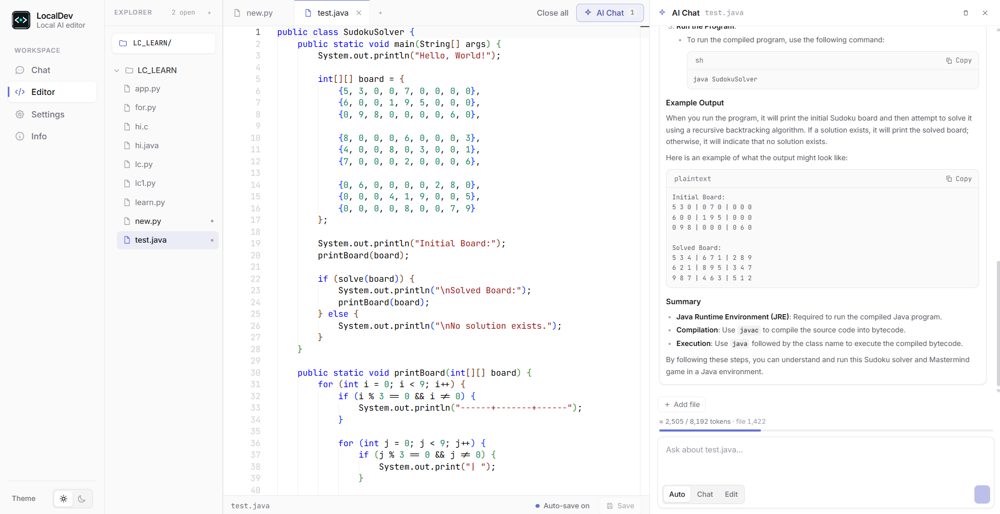
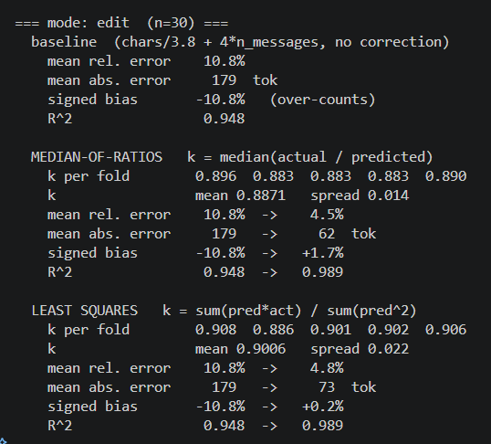
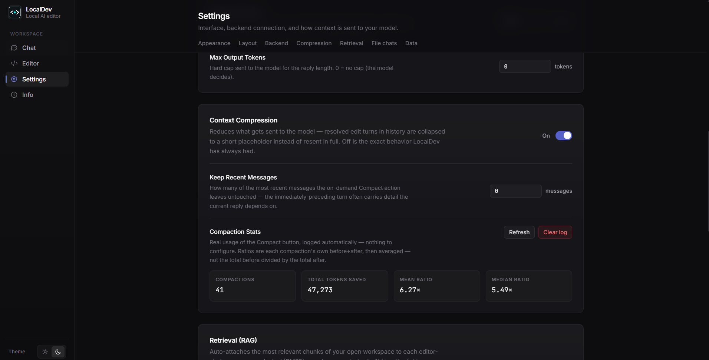

# LocalDev

A local-first AI coding assistant built around a small model: a React editor
and chat UI in the browser, a stateless FastAPI backend, and a 7B model running
in [LM Studio](https://lmstudio.ai/) (tested with Qwen2.5-7B-Instruct at an 8k
context window). No cloud calls, no API keys, no telemetry. Your code never
leaves your machine.

The interesting part is that constraint. A 7B model with 8k tokens of context
is unreliable at long context, multi-step planning, and sticking to an output
format. Instead of prompting around that, LocalDev keeps every model call
narrow and moves everything that needs reliability (reading files, ranking,
applying and checking edits) into ordinary, testable code.

> Full technical reference (state architecture, request lifecycle, persistence
> map, every module's job): [`docs/architecture.md`](docs/architecture.md).



## What it does

- **Chat about your code.** A main chat (any number of chats per project) and
  a per-file chat beside the editor. Replies stream in, render as Markdown with
  math, and keep streaming if you switch chats or pages.
- **Edit mode.** Ask for a change to one file and review it as a diff before
  anything is written.
- **Multi-file edits.** Describe a change. LocalDev picks the files, edits each
  one in its own focused call, checks every result, and opens a diff review
  where flagged files start unchecked and any file can be retried on its own.
- **Real files, from the browser.** Open a local folder (File System Access
  API), edit in Monaco, save straight to disk. The backend never sees a file
  or a path.
- **Retrieval (RAG).** A dependency-free BM25 index over the workspace attaches
  the most relevant chunks to each message. No embeddings, no extra model call.
- **Context management.** History is trimmed to a token budget, old edit replies
  collapse to short placeholders, and a Compact button summarizes older history
  into one message.

## How it works

- **The browser owns the files.** It reads the workspace, chooses context, and
  sends everything the model needs in the request. The backend keeps no state:
  it builds the prompt and streams the reply.
- **One pipeline for every chat.** Every chat is a thread in one store, and
  every turn runs through one engine: add an empty reply, build the request
  with a pure function, stream tokens into the reply. Stop, errors, and
  switching pages behave the same in every chat.
- **Streaming end to end.** LM Studio streams Server-Sent Events; the backend
  turns them into newline-delimited JSON events; the frontend reads every
  endpoint with one shared stream reader.
- **Multi-file edit is plan, then execute.**
  1. BM25 plus the import graph narrows the workspace to candidate files.
  2. A planner call sees those paths and a token-budgeted repo map (imports,
     "used by" links, related declarations) and answers with one
     `path :: instruction` line per file, streamed as it decides.
  3. The browser reads only the planned files.
  4. Each file gets its own call that also sees the full request and plan.
     Small files are rewritten; larger ones are edited with SEARCH/REPLACE
     blocks that apply only on an exact match, with one repair call and a
     full-rewrite fallback.
  5. Checks flag truncated, placeholder, shrunk, unchanged, or partly applied
     edits before review.

## Measured results

Two of the features above are backed by real, automatically-logged usage data
rather than one-off examples. Full methodology in
[`docs/architecture.md`](docs/architecture.md) (§6 for calibration, §8 for
compaction).

**Token-estimate calibration** — the chat's token-budget meter is a cheap
`chars ÷ 3.8` heuristic. Every real generation's actual token count (from the
model itself) gets logged alongside what the heuristic predicted, and a
k-fold cross-validated correction factor is fit offline — the error numbers
below are *held-out*, not training-set fit. Across 30 real edit-mode
generations, this cuts mean error from 11% to 5%.
*Tradeoff:* the correction is specific to edit-mode's prompt shape (raw code,
no line-numbering) — chat mode was already well-calibrated at baseline (~7%)
and barely benefits, and the factor hasn't been separately validated for
other estimates in the app (like compaction's, below) that use a different
formula.



**On-demand context compaction** — across 20 real uses of the "Compact"
button (both chats, logged automatically), the median before÷after size
reduction is **6.4×**, for roughly **25.9k tokens** saved in total.
*Tradeoff:* the 6.4× ratio is estimator-independent by construction — both
sides use the same token-counting heuristic, so its accuracy cancels out of
the ratio algebraically. The absolute token count is a best-effort estimate,
not a validated figure. Compaction is also destructive by design (folded-away
messages are gone from the stored thread, not just hidden), which is why it's
a manual, on-demand action rather than automatic.



## Project layout

```
frontend/src/
  pages/           one component per route: Chat, Editor, Settings, Info
  components/      UI: review modals, Markdown rendering, editor panes
  lib/chat/        thread store, the shared turn engine, chat lists
  lib/api/         backend calls and the shared NDJSON stream reader
  lib/rag/         tokenizer, chunker, BM25, repo-map outlines
  lib/multiEdit/   multi-file edit run state and planner candidates
  lib/editor/      folder access, tabs, Monaco setup
backend/
  routes/          one file per feature: chat, editor_chat, multi_edit, compact, edit
  llm.py           LM Studio streaming client
  apply_edits.py · edit_format.py · edit_checks.py   SEARCH/REPLACE and output checks
  tests/           pytest
bench/             offline analysis of the token logs
```

## Status

Actively developed. Built and working: both chats, Edit and multi-file edit,
RAG, compression, Compact, token logging, and an eval harness for multi-file
edit. Multi-file edit uses SEARCH/REPLACE blocks for larger files, which keeps
long edits fast. Next: SEARCH/REPLACE for single-file Edit mode, which doesn't
use it yet, and publishing the multi-file eval results here.

## Code availability

This repository currently holds documentation only — this README and
[`docs/architecture.md`](docs/architecture.md) — the source code itself
hasn't been published here yet. Everything above (features, measured results,
screenshots) describes a working build; the setup steps below show how it
runs once the `backend/` and `frontend/` source is released.

## Running it locally

**1. LM Studio** — load a model and start its local server (default
`http://localhost:1234`), OpenAI-compatible.

**2. Backend**
```bash
cd backend
python -m venv .venv
.venv\Scripts\activate          # or `source .venv/bin/activate` on macOS/Linux
pip install -r requirements.txt
uvicorn main:app --reload --port 8000
```

**3. Frontend**
```bash
cd frontend
npm install
npm run dev
```

Open the printed local URL, open a folder, and start chatting. The frontend
defaults to `http://localhost:8000` for the backend — override with a
`VITE_API_URL` env var if you're running it elsewhere.

## Tech stack

React 19 · Vite · TypeScript · Tailwind v4 · Monaco Editor · FastAPI · Pydantic
· LM Studio (OpenAI-compatible local inference)
